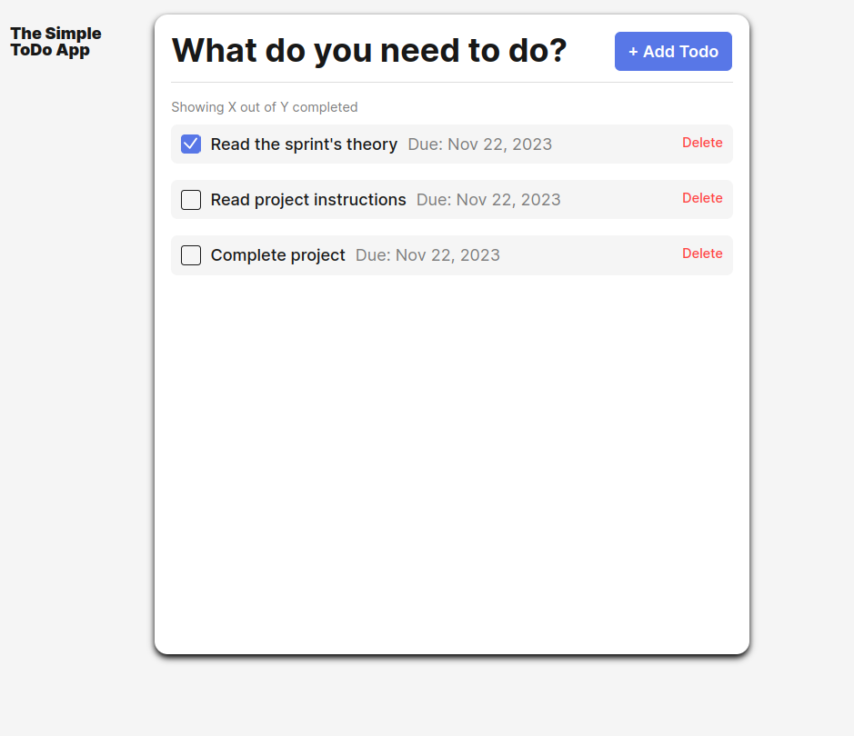

# Simple Todo App

Simple Todo App is an easy to use, web-browser To-Do list maker.

## Functionality

Users are able to create To-Do lists and optionally add deadlines for each To-Do list item.

## Technology

This project uses HTML, CSS, and JS (using Object-Oriented Programming practices).

## Deployment

This project is deployed on GitHub Pages:

- [GitHub Pages Link](https://scottstraube.github.io/se_project_todo-app/)
